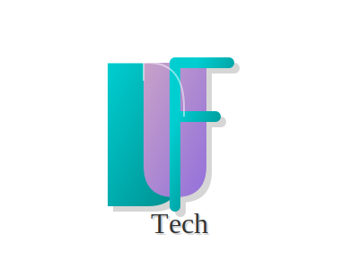

# DUF Tech Mülakat Asistanı / DUF Tech Interview Assistant

<div align="center">
  
  <p>
    <strong>Yapay Zeka Destekli Mülakat Yönetim Sistemi</strong><br/>
    <em>AI-Powered Interview Management System</em>
  </p>
  <p>
    <a href="#türkçe">🇹🇷 Türkçe</a> |
    <a href="#english">🇬🇧 English</a>
  </p>

  <p>
    
    
    
    
  </p>
</div>

---

# 🇹🇷 Türkçe

## 📑 İçindekiler
1. [Proje Hakkında](#-proje-hakkında)
2. [Özellikler](#-özellikler)
3. [Teknoloji Yığını](#-teknoloji-yığını)
4. [Sistem Gereksinimleri](#-sistem-gereksinimleri)
5. [Kurulum](#-kurulum)
6. [Konfigürasyon](#-konfigürasyon)
7. [Domain Yapılandırması](#-domain-yapılandırması)
8. [Kullanım](#-kullanım)
9. [API Dokümantasyonu](#-api-dokümantasyonu)
10. [Güvenlik](#-güvenlik)
11. [Hata Ayıklama](#-hata-ayıklama)
12. [SSS](#-sss)
13. [Katılım](#-katılım)
14. [Lisans](#-lisans)

## 📋 Proje Hakkında

DUF Tech Mülakat Asistanı, yapay zeka teknolojilerini kullanarak mülakat süreçlerini otomatize eden gelişmiş bir sistemdir. Gerçek zamanlı ses tanıma, doğal dil işleme ve yapay zeka destekli değerlendirme özellikleriyle, insan kaynakları süreçlerini daha verimli ve objektif hale getirir.

### 🎯 Temel Amaçlar
- Mülakat süreçlerini standardize etmek
- Değerlendirme sürecini objektifleştirmek
- Zaman ve kaynak tasarrufu sağlamak
- Aday deneyimini iyileştirmek
- Veri odaklı işe alım kararları almak

## 🚀 Özellikler

### 💬 Mülakat Yönetimi
- **Gerçek Zamanlı Ses İşleme**
  - WebRTC tabanlı ses kaydı
  - FFmpeg ile ses formatı dönüşümü
  - OpenAI Whisper ile ses tanıma
  - Gürültü filtreleme ve ses iyileştirme

- **Yapay Zeka Entegrasyonu**
  - GPT-4 destekli mülakat yönetimi
  - Dinamik soru üretimi
  - Bağlama duyarlı yanıt analizi
  - Duygu analizi ve değerlendirme

- **Çoklu Dil Desteği**
  - Türkçe ve İngilizce ana dil desteği
  - Otomatik dil algılama
  - Dile özel değerlendirme kriterleri

### 📊 Raporlama ve Analiz
- **PDF Rapor Oluşturma**
  - Detaylı mülakat transkripti
  - Performans metrikleri
  - Görsel grafikler ve analizler
  - Özelleştirilebilir şablonlar

- **Değerlendirme Metrikleri**
  - Teknik yetkinlik analizi
  - İletişim becerileri değerlendirmesi
  - Problem çözme yeteneği ölçümü
  - Kişilik ve uyum analizi

### 🔄 Entegrasyon Özellikleri
- **Webhook Desteği**
  - Gerçek zamanlı olay bildirimleri
  - ATS sistemleri ile entegrasyon
  - Özelleştirilebilir veri formatları
  - Güvenli iletişim protokolleri

- **E-posta Entegrasyonu**
  - Otomatik rapor gönderimi
  - Mülakat davetleri
  - Hatırlatma bildirimleri
  - Özelleştirilebilir şablonlar

## 💻 Teknoloji Yığını

### Backend
- **Python 3.8+**
  - Flask web çerçevesi
  - Asyncio eşzamansız işlemler
  - SQLAlchemy ORM
  - PyJWT token yönetimi

### Frontend
- **HTML5/CSS3**
  - TailwindCSS
  - Responsive tasarım
  - Progressive Web App desteği

- **JavaScript**
  - WebRTC ses işleme
  - Gerçek zamanlı UI güncellemeleri
  - Service Worker desteği

### AI/ML
- **OpenAI Entegrasyonları**
  - GPT-4 API
  - Whisper API
  - DALL-E API (avatar oluşturma)

### Veritabanı
- **SQLite**
  - Yerleşik veritabanı
  - Yüksek performans
  - Kolay yedekleme

### DevOps
- **Docker**
  ```dockerfile
  FROM python:3.8-slim
  WORKDIR /app
  COPY requirements.txt .
  RUN pip install -r requirements.txt
  COPY . .
  CMD ["python", "app.py"]
  ```

- **CI/CD**
  - GitHub Actions
  - Otomatik test
  - Otomatik dağıtım

## 🖥️ Sistem Gereksinimleri

### Minimum Gereksinimler
- 2 CPU çekirdek
- 4GB RAM
- 20GB disk alanı
- Python 3.8+
- FFmpeg
- SQLite3

### Önerilen Gereksinimler
- 4 CPU çekirdek
- 8GB RAM
- 50GB SSD
- Python 3.10+
- NVIDIA GPU (opsiyonel)

## ⚙️ Kurulum

### 1. Bağımlılıkların Yüklenmesi
```bash
# Sanal ortam oluştur
python -m venv .venv
source .venv/bin/activate  # Linux/Mac
.venv\Scripts\activate     # Windows

# Bağımlılıkları yükle
pip install -r requirements.txt
```

### 2. Çevresel Değişkenler
```bash
# .env dosyası oluştur
cp .env.example .env

# .env dosyasını düzenle
nano .env
```

### 3. Veritabanı Kurulumu
```bash
# Veritabanını başlat
python
>>> from app import db
>>> db.create_all()
>>> exit()
```

### 4. Uygulamayı Başlat
```bash
# Geliştirme modu
python app.py

# Prodüksiyon modu
gunicorn app:app --workers 4 --bind 0.0.0.0:5000
```

## 🔧 Konfigürasyon

### .env Dosyası
```env
# OpenAI Ayarları
OPENAI_API_KEY=your_api_key
OPENAI_ORG_ID=your_org_id

# E-posta Ayarları
SMTP_SERVER=smtp.gmail.com
SMTP_PORT=587
SMTP_USERNAME=your_email
SMTP_PASSWORD=your_password

# Webhook Ayarları
WEBHOOK_URL=your_webhook_url
WEBHOOK_SECRET=your_secret

# Güvenlik
SECRET_KEY=your_secret_key
JWT_SECRET=your_jwt_secret
```

### Ses Ayarları
```python
AUDIO_SETTINGS = {
    'format': 'wav',
    'channels': 1,
    'rate': 16000,
    'chunk': 1024,
    'silence_threshold': 500,
    'silence_duration': 1.5
}
```

## 🌐 Domain Yapılandırması

### www.aimulakat.duftech.com.tr Kurulumu

DUF Tech Mülakat Asistanı'nı `www.aimulakat.duftech.com.tr` adresinde çalıştırmak için aşağıdaki adımları izleyin:

#### 1. Ortam Değişkenleri

`.env` dosyasına domain ile ilgili yapılandırmaları ekleyin:

```env
# Domain Ayarları
DOMAIN_NAME=www.aimulakat.duftech.com.tr
PORT=5000
```

#### 2. Gunicorn ile Sunucu Kurulumu

Gunicorn ile üretim ortamında çalıştırmak için:

```bash
# Gunicorn yükleyin
pip install gunicorn

# Uygulamayı başlatın
gunicorn --bind 0.0.0.0:5000 --workers 4 --threads 2 wsgi:application
```

#### 3. Nginx Yapılandırması

Nginx sunucusu ile reverse proxy yapılandırması:

```nginx
server {
    listen 80;
    server_name www.aimulakat.duftech.com.tr aimulakat.duftech.com.tr;
    
    location / {
        proxy_pass http://127.0.0.1:5000;
        proxy_set_header Host $host;
        proxy_set_header X-Real-IP $remote_addr;
        proxy_set_header X-Forwarded-For $proxy_add_x_forwarded_for;
        proxy_set_header X-Forwarded-Proto $scheme;
    }
    
    # Websocket desteği
    location /socket.io {
        proxy_pass http://127.0.0.1:5000/socket.io;
        proxy_http_version 1.1;
        proxy_set_header Upgrade $http_upgrade;
        proxy_set_header Connection "upgrade";
        proxy_set_header Host $host;
        proxy_set_header X-Real-IP $remote_addr;
    }
}
```

#### 4. SSL Sertifikası

Let's Encrypt ile ücretsiz SSL sertifikası edinme:

```bash
# Certbot yükleyin
sudo apt install certbot python3-certbot-nginx

# Sertifika alın
sudo certbot --nginx -d www.aimulakat.duftech.com.tr -d aimulakat.duftech.com.tr
```

#### 5. Systemd Servis Yapılandırması

Sürekli çalışır durumda tutmak için systemd servis dosyası oluşturun:

```bash
sudo nano /etc/systemd/system/duftech-interview.service
```

```ini
[Unit]
Description=DufTech AI Mülakat Sistemi
After=network.target

[Service]
User=<kullanıcı_adınız>
Group=<grup_adınız>
WorkingDirectory=/path/to/mulakat-duftech
Environment="PATH=/path/to/mulakat-duftech/venv/bin"
ExecStart=/path/to/mulakat-duftech/venv/bin/gunicorn --workers 4 --bind 0.0.0.0:5000 wsgi:application
Restart=always

[Install]
WantedBy=multi-user.target
```

Servisi etkinleştirin ve başlatın:

```bash
sudo systemctl enable duftech-interview
sudo systemctl start duftech-interview
sudo systemctl status duftech-interview
```

#### 6. Firewall Yapılandırması

```bash
# HTTP ve HTTPS portlarını açın
sudo ufw allow 80/tcp
sudo ufw allow 443/tcp
```

#### 7. DNS Kayıtları

Domain sağlayıcınızda aşağıdaki DNS kayıtlarını oluşturun:

```
A     www.aimulakat.duftech.com.tr    <Sunucu_IP_Adresi>
A     aimulakat.duftech.com.tr        <Sunucu_IP_Adresi>
```

## 📱 Kullanım

### 1. Mülakat Oluşturma
```bash
# POST /create_interview
curl -X POST http://localhost:5000/create_interview \
  -H "Content-Type: application/json" \
  -d '{
    "candidate_name": "Aday Adı",
    "position": "Pozisyon",
    "requirements": ["Req1", "Req2"],
    "custom_questions": ["Q1", "Q2"]
  }'
```

### 2. Webhook Entegrasyonu
```bash
# POST /webhook/interview
curl -X POST http://localhost:5000/webhook/interview \
  -H "Content-Type: application/json" \
  -d '{
    "adSoyad": "Aday Adı",
    "isIlaniPozisyonu": "Pozisyon",
    "isIlaniGereksinimleri": ["Req1", "Req2"]
  }'
```

## 📚 API Dokümantasyonu

### Mülakat API'leri

#### 1. Mülakat Oluşturma
```http
POST /create_interview
Content-Type: application/json

{
  "candidate_name": string,
  "position": string,
  "requirements": string[],
  "custom_questions": string[]
}
```

#### 2. Ses İşleme
```http
POST /process_audio
Content-Type: multipart/form-data

audio: <audio_file>
interview_code: string
```

#### 3. Rapor Oluşturma
```http
POST /generate_report
Content-Type: application/json

{
  "interview_code": string,
  "include_metrics": boolean
}
```

### Webhook API'leri

#### 1. Mülakat Webhook'u
```http
POST /webhook/interview
Content-Type: application/json

{
  "adSoyad": string,
  "isIlaniPozisyonu": string,
  "isIlaniGereksinimleri": string[]
}
```

#### 2. Rapor Webhook'u
```http
POST /webhook/report
Content-Type: application/json

{
  "interview_code": string,
  "report_url": string,
  "metrics": object
}
```

## 🔒 Güvenlik

### Kimlik Doğrulama
- JWT tabanlı token sistemi
- Rol tabanlı yetkilendirme
- Oturum yönetimi
- Rate limiting

### Veri Güvenliği
- SSL/TLS şifreleme
- Veritabanı şifreleme
- Dosya sistemi güvenliği
- GDPR uyumluluğu

### Güvenlik Önlemleri
- XSS koruması
- CSRF koruması
- SQL injection koruması
- Dosya upload güvenliği

## 🐛 Hata Ayıklama

### Hata Logları
```bash
# Log dosyasını görüntüle
tail -f app.log

# Hata loglarını filtrele
grep ERROR app.log

# Son 100 satır
tail -n 100 app.log
```

### Yaygın Hatalar

#### 1. Ses Kaydı Hataları
```python
# Mikrofonla ilgili hatalar
if not audio_device_found:
    check_microphone_permissions()
    initialize_audio_device()
```

#### 2. API Hataları
```python
# API yanıt hataları
try:
    api_response = make_api_call()
except APIError as e:
    logger.error(f"API Error: {str(e)}")
    handle_api_error(e)
```

## ❓ SSS

### Genel Sorular

**S: Sistem hangi dilleri destekliyor?**
C: Şu anda Türkçe ve İngilizce tam destek sunulmaktadır.

**S: Ses kalitesi nasıl optimize edilebilir?**
C: FFmpeg ayarları ve gürültü filtreleme parametreleri kullanılabilir.

### Teknik Sorular

**S: WebRTC bağlantı sorunları nasıl çözülür?**
C: STUN/TURN sunucu ayarları ve ICE yapılandırması kontrol edilmelidir.

**S: API rate limiting nasıl çalışır?**
C: Redis tabanlı rate limiting ile istek sayısı kontrol edilir.

## 👥 Katılım

### Geliştirme Süreci
1. Fork the repository
2. Create your feature branch
3. Commit your changes
4. Push to the branch
5. Create a Pull Request

### Kod Standartları
- PEP 8 stilini takip edin
- Docstring kullanın
- Unit testler ekleyin
- Type hinting kullanın

## 📄 Lisans

Bu proje MIT lisansı altında lisanslanmıştır. Detaylar için [LICENSE](LICENSE) dosyasına bakın.

---

# 🇬🇧 English

## 📑 Table of Contents
1. [About the Project](#-about-the-project)
2. [Features](#-features)
3. [Technology Stack](#-technology-stack)
4. [System Requirements](#-system-requirements)
5. [Installation](#-installation)
6. [Configuration](#-configuration)
7. [Usage](#-usage)
8. [API Documentation](#-api-documentation)
9. [Security](#-security)
10. [Troubleshooting](#-troubleshooting)
11. [FAQ](#-faq)
12. [Contributing](#-contributing)
13. [License](#-license)

## 📋 About the Project

DUF Tech Interview Assistant is an advanced system that automates interview processes using artificial intelligence technologies. With real-time speech recognition, natural language processing, and AI-powered evaluation capabilities, it makes human resources processes more efficient and objective.

### 🎯 Core Objectives
- Standardize interview processes
- Objectify evaluation process
- Save time and resources
- Improve candidate experience
- Make data-driven hiring decisions

## 🚀 Features

### 💬 Interview Management
- **Real-Time Audio Processing**
  - WebRTC-based audio recording
  - FFmpeg audio format conversion
  - OpenAI Whisper speech recognition
  - Noise filtering and audio enhancement

- **AI Integration**
  - GPT-4 powered interview management
  - Dynamic question generation
  - Context-aware response analysis
  - Sentiment analysis and evaluation

- **Multi-language Support**
  - English and Turkish language support
  - Automatic language detection
  - Language-specific evaluation criteria

### 📊 Reporting and Analysis
- **PDF Report Generation**
  - Detailed interview transcript
  - Performance metrics
  - Visual graphs and analysis
  - Customizable templates

- **Evaluation Metrics**
  - Technical competency analysis
  - Communication skills assessment
  - Problem-solving ability measurement
  - Personality and fit analysis

### 🔄 Integration Features
- **Webhook Support**
  - Real-time event notifications
  - ATS system integration
  - Customizable data formats
  - Secure communication protocols

- **Email Integration**
  - Automatic report delivery
  - Interview invitations
  - Reminder notifications
  - Customizable templates

## 💻 Technology Stack

### Backend
- **Python 3.8+**
  - Flask web framework
  - Asyncio asynchronous operations
  - SQLAlchemy ORM
  - PyJWT token management

### Frontend
- **HTML5/CSS3**
  - TailwindCSS
  - Responsive design
  - Progressive Web App support

- **JavaScript**
  - WebRTC audio processing
  - Real-time UI updates
  - Service Worker support

### AI/ML
- **OpenAI Integrations**
  - GPT-4 API
  - Whisper API
  - DALL-E API (avatar generation)

### Database
- **SQLite**
  - Embedded database
  - High performance
  - Easy backup

### DevOps
- **Docker**
  ```dockerfile
  FROM python:3.8-slim
  WORKDIR /app
  COPY requirements.txt .
  RUN pip install -r requirements.txt
  COPY . .
  CMD ["python", "app.py"]
  ```

- **CI/CD**
  - GitHub Actions
  - Automated testing
  - Automated deployment

## 🖥️ System Requirements

### Minimum Requirements
- 2 CPU cores
- 4GB RAM
- 20GB disk space
- Python 3.8+
- FFmpeg
- SQLite3

### Recommended Requirements
- 4 CPU cores
- 8GB RAM
- 50GB SSD
- Python 3.10+
- NVIDIA GPU (optional)

## ⚙️ Installation

### 1. Install Dependencies
```bash
# Create virtual environment
python -m venv .venv
source .venv/bin/activate  # Linux/Mac
.venv\Scripts\activate     # Windows

# Install requirements
pip install -r requirements.txt
```

### 2. Environment Variables
```bash
# Create .env file
cp .env.example .env

# Edit .env file
nano .env
```

### 3. Database Setup
```bash
# Initialize database
python
>>> from app import db
>>> db.create_all()
>>> exit()
```

### 4. Start Application
```bash
# Development mode
python app.py

# Production mode
gunicorn app:app --workers 4 --bind 0.0.0.0:5000
```

## 🔧 Configuration

### .env File
```env
# OpenAI Settings
OPENAI_API_KEY=your_api_key
OPENAI_ORG_ID=your_org_id

# Email Settings
SMTP_SERVER=smtp.gmail.com
SMTP_PORT=587
SMTP_USERNAME=your_email
SMTP_PASSWORD=your_password

# Webhook Settings
WEBHOOK_URL=your_webhook_url
WEBHOOK_SECRET=your_secret

# Security
SECRET_KEY=your_secret_key
JWT_SECRET=your_jwt_secret
```

### Audio Settings
```python
AUDIO_SETTINGS = {
    'format': 'wav',
    'channels': 1,
    'rate': 16000,
    'chunk': 1024,
    'silence_threshold': 500,
    'silence_duration': 1.5
}
```

## 📱 Usage

### 1. Create Interview
```bash
# POST /create_interview
curl -X POST http://localhost:5000/create_interview \
  -H "Content-Type: application/json" \
  -d '{
    "candidate_name": "Candidate Name",
    "position": "Position",
    "requirements": ["Req1", "Req2"],
    "custom_questions": ["Q1", "Q2"]
  }'
```

### 2. Webhook Integration
```bash
# POST /webhook/interview
curl -X POST http://localhost:5000/webhook/interview \
  -H "Content-Type: application/json" \
  -d '{
    "candidate_name": "Candidate Name",
    "position": "Position",
    "requirements": ["Req1", "Req2"]
  }'
```

## 📚 API Documentation

### Interview APIs

#### 1. Create Interview
```http
POST /create_interview
Content-Type: application/json

{
  "candidate_name": string,
  "position": string,
  "requirements": string[],
  "custom_questions": string[]
}
```

#### 2. Process Audio
```http
POST /process_audio
Content-Type: multipart/form-data

audio: <audio_file>
interview_code: string
```

#### 3. Generate Report
```http
POST /generate_report
Content-Type: application/json

{
  "interview_code": string,
  "include_metrics": boolean
}
```

### Webhook APIs

#### 1. Interview Webhook
```http
POST /webhook/interview
Content-Type: application/json

{
  "candidate_name": string,
  "position": string,
  "requirements": string[]
}
```

#### 2. Report Webhook
```http
POST /webhook/report
Content-Type: application/json

{
  "interview_code": string,
  "report_url": string,
  "metrics": object
}
```

## 🔒 Security

### Authentication
- JWT-based token system
- Role-based authorization
- Session management
- Rate limiting

### Data Security
- SSL/TLS encryption
- Database encryption
- File system security
- GDPR compliance

### Security Measures
- XSS protection
- CSRF protection
- SQL injection protection
- File upload security

## 🐛 Troubleshooting

### Error Logs
```bash
# View log file
tail -f app.log

# Filter error logs
grep ERROR app.log

# Last 100 lines
tail -n 100 app.log
```

### Common Issues

#### 1. Audio Recording Issues
```python
# Microphone-related errors
if not audio_device_found:
    check_microphone_permissions()
    initialize_audio_device()
```

#### 2. API Issues
```python
# API response errors
try:
    api_response = make_api_call()
except APIError as e:
    logger.error(f"API Error: {str(e)}")
    handle_api_error(e)
```

## ❓ FAQ

### General Questions

**Q: Which languages are supported?**
A: Currently, English and Turkish are fully supported.

**Q: How can audio quality be optimized?**
A: FFmpeg settings and noise filtering parameters can be adjusted.

### Technical Questions

**Q: How to resolve WebRTC connection issues?**
A: Check STUN/TURN server settings and ICE configuration.

**Q: How does API rate limiting work?**
A: Request count is controlled with Redis-based rate limiting.

## 👥 Contributing

### Development Process
1. Fork the repository
2. Create your feature branch
3. Commit your changes
4. Push to the branch
5. Create a Pull Request

### Code Standards
- Follow PEP 8 style
- Use docstrings
- Add unit tests
- Use type hinting

## 📄 License

This project is licensed under the MIT License. See the [LICENSE](LICENSE) file for details.

<div align="center">
  <p>Developed with ❤️ by DUF Tech</p>
  <p>
    <a href="https://www.duftech.io">Website</a> |
    <a href="https://github.com/duftech">GitHub</a> |
    <a href="https://www.linkedin.com/company/duftech">LinkedIn</a>
  </p>
</div>